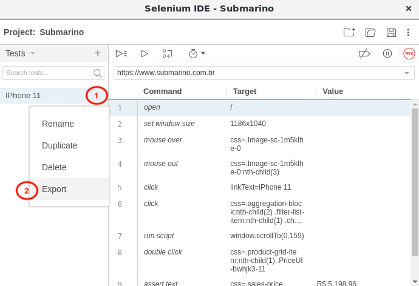
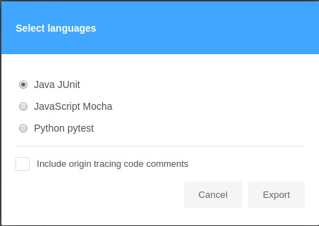

# Selenium IDE, Side Runner e integração com o Junit/Manven

O [Selenium](https://www.selenium.dev) fornece ferramentas par criação e reprodução de testes funcionais. Entre as principais ferramentas do Selenium são o Selenium IDE e o Selenium Side Runner. O IDE é uma ferramenta que funciona como um plugin do Chrome e Firefox capaz de gravar, editar, depurar testes funcionais na Web. Outra característica interessante do Selenium IDE é a possibilidade de exportar o testes na linguagem em Java/Junit, facilitando assim, a integração dentro do processo de integração contínua com o Maven. Por outro lado, o Side Runner é uma *software* baseado em [Nodejs](https://nodejs.org/en/) preparado para executar, por meio do interpretador de comandos, testes que foram previamente exportados pelo Selenium IDE. Assim, esse documento mostra aspectos da instalação e uso dessas ferramentas bastante conhecidas dentro do assunto de teste funcionais.
## Selenium IDE

Como dito anteriormente, o Selenium IDE é uma ferramenta para gravação, edição e depuração de testes, ou seja, na prática trata-se do local onde os testes serão planejados, criados e testados. O Vídeo 1 ilustra detalhes de instalação e execução de um pequeno teste de exemplo com o Selenium IDE.

<center>
    <iframe
    width="560" height="315"
    src="https://www.youtube.com/embed/l2vfOkYwQlE"
    frameborder="0"
    allow="accelerometer; autoplay; clipboard-write; encrypted-media; gyroscope; picture-in-picture"
    allowfullscreen>
    </iframe>
</center>

<center>Vídeo 1 - Hello World com o Selenium IDE</center>

Alguns passos para reproduzir o exemplo do vídeo:

* Acesse: https://www.seleniumhq.org/selenium-ide/
* Instale o plugin do Selenium para Chrome ou Firefox
* Depois de acessar, escolha a opção "*Record a new test in a new Project*" para criar um caso de teste
* Informe um nome para o projeto, como exemplo, informe “IFRS”
* Logo, informe a URL do sistema que será testado, por exemplo, "http://ifrs.edu.br"
* Como botão de gravação **ligado**, navegue pela página no IFRS até chegar no edital de fomento interno  [64/2019](https://ifrs.edu.br/editais/edital-ifrs-no-64-2019-fomento-interno-para-projetos-de-pesquisa-e-inovacao-2020-2021/)
* Depois de chegar até a página de destino, pare a gravação
* Insira um commando/assertiva na sequência do teste para verificar se o título do edital está presente na página: `assert element present`
* Utilize a funcionalidade "*Select target in page*" para fazer com que o Selenium identifique o elemento da página que possui o título
* Rode o teste para verificar se a execução está correta
* Exporte o teste no formato `.side` para poder salvar e/ou executar com o Side Runner.

---
Nota: Um exemplo similar ao do vídeo (arquivo `.side`) pode ser obtido [aqui](https://github.com/rodrigoprestesmachado/vvs/blob/master/selenium/ifrs.side).

---

## Instalação do Selenium-side-runner

O Selenium Side Runner é uma aplicação que permite chamar a execução de um navegador na linha de comando e, assim, executar casos de testes no formato `.side`. Inicialmente, devemos instalar o Side Runner, abaixo seguem os passos de instalação em um Ubuntu:

* `sudo apt update`
* `sudo apt install nodejs`
* `sudo apt install npm`
* `sudo npm install -g selenium-side-runner`

### Instalação do driver para Firefox ou Chrome

* Firefox: `sudo npm install -g geckodriver`
* Chrome: `sudo npm install -g chromedriver`

Depois de instalar, podemos executar o Side Runner da seguinte maneira no Firefox e/ou Chrome:

* `selenium-side-runner -c "browserName=firefox"` [ifrs.side](https://github.com/rodrigoprestesmachado/vvs/blob/master/selenium/ifrs.side)
* `selenium-side-runner -c "browserName=chrome"` [ifrs.side](https://github.com/rodrigoprestesmachado/vvs/blob/master/selenium/ifrs.side)

---
Atenção: não execute o selenium-side-runner com o `sudo`

---

## Integração do Selenium com o Junit/Maven

Para rodar casos/suíte de teste do Selenium por intermédio do Junit, temos que primeiro exportar o teste da IDE, conforme ilustra os passos um e dois da imagem abaixo:



Logo, escolha a opção Junit para poder obter um código em Java.



Agora, temos que compilar a classe para que possamos executar o código. A classe que obtivemos da IDE possui duas dependências: (1) [Junit 4](https://mvnrepository.com/artifact/junit/junit) e (2) [Selenium Java](https://mvnrepository.com/artifact/org.seleniumhq.selenium/selenium-java). 

Para poder utilizar o Selenium Java adicione a seguinte dependência do Maven no arquivo `pom.xml` do seu projeto:

```xml
 <dependency>
    <groupId>org.seleniumhq.selenium</groupId>
    <artifactId>selenium-java</artifactId>
    <version>4.0.0-alpha-7</version>
</dependency>
```

---
Atenção: Atualmente o Selenium IDE exporta classes de testes no formato de Junit 4, assim, se você quiser trabalhar na versão 5 do Junit, será necessário adaptar o código, como por exemplo, substituir a anotações que atualmente estão depreciadas no Junit 4 pelas novas [anotações](https://junit.org/junit5/docs/current/user-guide/#writing-tests-annotations) do Junit 5.

---

Por padrão, a classe Java que foi exportada do Selenium IDE utiliza o Chrome Driver para executar os testes. Assim, certifique-se que o Chrome e o Chrome Driver estão instalados no seu computador. As instruções de como instalar o Chrome Driver podem ser obtidas nno seguinte endereço na Web: [ChromeDriver](https://github.com/SeleniumHQ/selenium/wiki/ChromeDriver).